# <a name="openC2-integration-framework-(oif)-orchestrator-walk-through"></a> OpenC2 Integration Framework (OIF) Orchestrator Walk Through

This document provides a detailed walk through of the
installation, configuration, startup, and basic operations of the OIF
Orchestrator. The Orchestrator implements the OpenC2
[Producer](https://docs.oasis-open.org/openc2/oc2ls/v1.0/cs02/oc2ls-v1.0-cs02.html#16-overview)
function. The following diagram provides a high-level
overview of the OIF Orchestrator's construction:

<table><tr><td style="padding:0;">
 
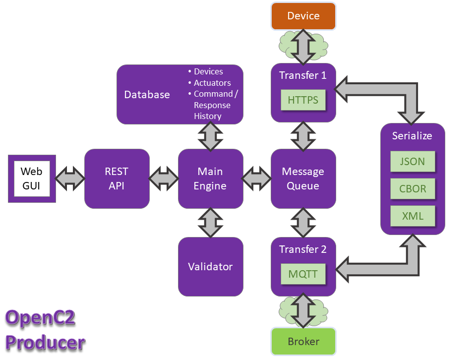

</td></tr></table>

This walk through focuses on the use of the HTTP / HTTPS
transfer protocol for message exchange between the
Orchestrator and the Device. Some additional notes are
provided at the end for utilizing the MQTT publish /
subscribe protocol in place of HTTP(S).

## 1) System Preparation
 - Required:  
   - [Python 3.10+](https://www.python.org/)
     - [pip 18+](https://pip.pypa.io/en/stable/)
   - [Docker 18.0+](https://www.docker.com/)
     - [Docker Compose 1.20+](https://docs.docker.com/compose/)
 - Optional: 
   - [Git Latest Version](https://git-scm.com/)

[Pip](https://pip.pypa.io/en/stable/) and [Docker Compose](https://docs.docker.com/compose/)
are needed for configuration and startup.  Pip is usually [installed with
Python](https://pip.pypa.io/en/stable/installing/). Docker Compose is [installed with
Docker](https://docs.docker.com/compose/install/) on Windows
and Mac systems, but must be installed separately on Linux
systems.  If using a Linux environment, then the [post-installation steps for
Linux](https://docs.docker.com/engine/install/linux-postinstall/) are also needed,
specifically:

 * Manage Docker as a non-root user
 * Configure Docker to start on boot

Users are advised to update all the software components to the latest versions.

Users may optionally install [git](https://git-scm.com/) version control software, as a means of obtaining the OIF
Orchestrator software.

## 2) Obtain the Software

There are two approaches to obtain the software, clone via git or download using ZIP:
 1. Clone the [OIF Orchestrator Repository](https://github.com/oasis-open/openc2-oif-orchestrator) in the desired location:<br>
    `git clone https://github.com/oasis-open/openc2-oif-orchestrator.git`
 1. Download a ZIP archive by 
    1. Navigating to the [OIF Orchestrator Repository](https://github.com/oasis-open/openc2-oif-orchestrator).
	1. Click on the green **Code** button.
	1. Select **Download ZIP**.
	1. Unwrap the ZIP archive in the desired location.

## 3) Configuration 

To configure the OIF Orchestrator, navigate to the directory containing the local software copy 
and run `configure.py` with the desired options prior to starting the OIF Orchestrator for the first time.

View all configuration options:
```bash 
python3 configure.py -h
```

Run with default configuration:
```bash 
python3 configure.py
```

Run with logging to the designated file and in verbose mode:
```bash 
python3 configure.py -f FILE -v
```

## 4) Run the OIF Orchestrator

As described in [its documentation](https://docs.docker.com/compose/), Docker
Compose is used to "define and run multi-container Docker
applications". To start OIF Orchestrator in its default
configuration, the only required command is:

```bash
  docker-compose -f orchestrator-compose.yaml up
```

This command will:
 - Create the necessary Docker images as defined in the
   `orchestrator-compose.yml` configuration file
 - Execute the application in the defined containers,
   attached to the terminal from which it was launched  

Execution of an attached OIF instance is terminated by
typing `ctrl-c` in the terminal.

The Orchestrator can also be started in detached mode using
the docker-compose `-d` or `--detach` option:

```bash
  docker-compose up --detach
```

A detached instance of OIF is terminated with the complementary command:

```bash
docker-compose down
```

This command should also be run after terminating an
attached OIF instance with `ctrl-c`, as it also performs a number
of desirable clean-up actions.

## 5) Accessing the Orchestrator GUI

The OIF Orchestrator provides a graphical user interface
(GUI) for the user to manage devices and
actuators, and create and send OpenC2 commands and
review responses The GUI is accessed at
`http://localhost:8080`.  Browsing to the User GUI location brings up the login
screen:

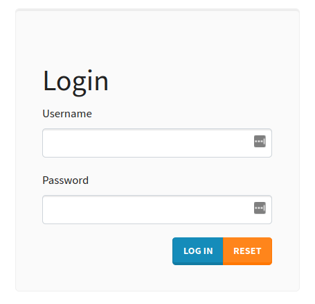

The default login credentials are 
 - Username: `admin`
 - Password: `password`

After login to the User GUI you will see the home screen
with the system menu. A `theme` menu is available in the
bottom right corner to alter the GUI color scheme.
The `Hello, {USER}` menu at the right provides access to log off,
password change, and system administration features.
Information about the system administration features is
provided in the [Orchestrator README file](../README.md/#user-features).

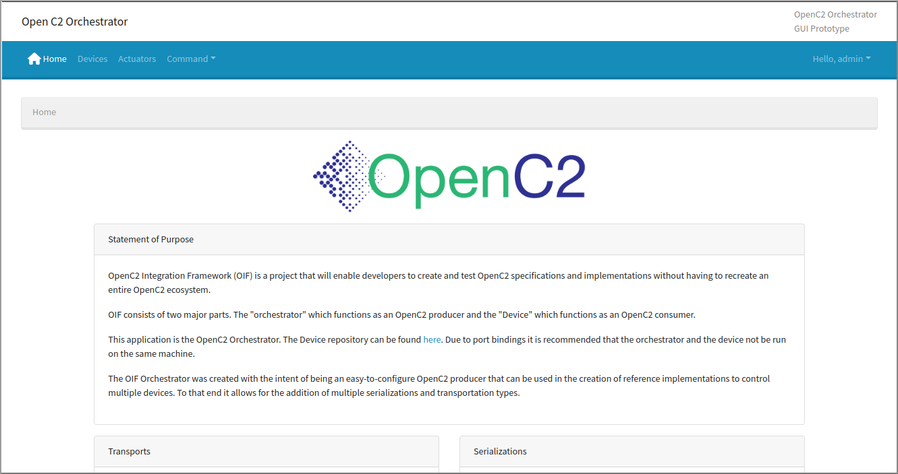  

## 6) Create Devices and  Actuators

An OIF Device is an entity that groups one or more OpenC2
actuators and provides a communications interface so that
the Orchestrator can issue commands and receive responses.
Note that the Device isn't explicitly mentioned in the
[OpenC2
specifications](https://www.oasis-open.org/committees/tc_home.php?wg_abbrev=openc2#technical),
it's an OIF construct. The following diagram illustrates the
organization of an OIF Device:

<table><tr><td style="padding:0;">


</td></tr></table>

Devices and their associated actuators have to be registered
in the OIF Orchestrator before interactions with them are
possible. In addition, actuators must have an associated
JSON schema to inform the Orchestrator of the action/target
pairs the actuator can process.

Devices and actuators have associated identifiers. Within
OIF these are required to be v4 UUIDs; this is an OIF
requirement rather than an OpenC2 requirement. While the UI
will permit the user to enter a non-UUID value as an
identifier, an error will occur when attempting to exchange
commands and responses.

### Registering a Device with the OIF

The procedure to create a new device is:

1. Select `Devices` from the Orchestrator menu; this brings up
  the list of registered devices.
1. Click the `REGISTER` button at the right; this opens the
   dialog to register a new device.
1. Give the device a name (user's discretion).
1. Click the `GEN ID` button to generate a Device ID (Note: while
   the field permits user entry of an arbitrary ID, the
   Orchestrator expects a UUID value here).
1. Enter the Device's IP address and Port.
   - Default port for HTTPS Transfer is 5001
   - Default port for MQTT Transfer is 1883
   - Host: Enter your MQTT Broker
1. Select the transfer protocol to use with this device.
1. Select the message serialization(s) to use with this device.
   JSON is the default serialization for OpenC2.
1. Enter any desired information in the `Note` field. This
   is typically used to provide a human-friendly description
   of the device's type.
1. Click the `REGISTER` button at bottom right to complete
   the device registration.

The screenshots below show the registered devices list and device
editing dialog:
/home/matt/Documents/SB/oif-orc-home-screen.png

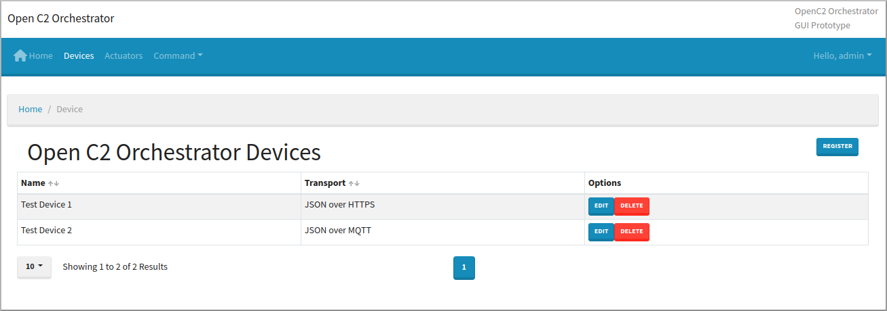

Device registration notes:

- Registered devices have an `EDIT` button that re-opens the
  registration dialog for updating
- The blue `+`  button in the registration dialog permits
  defining additional transport interfaces for a device.
- The red `x`  button in the registration dialog deletes the
  associated transport interfaces from the device.

#### HTTPS Registration Screen Shots

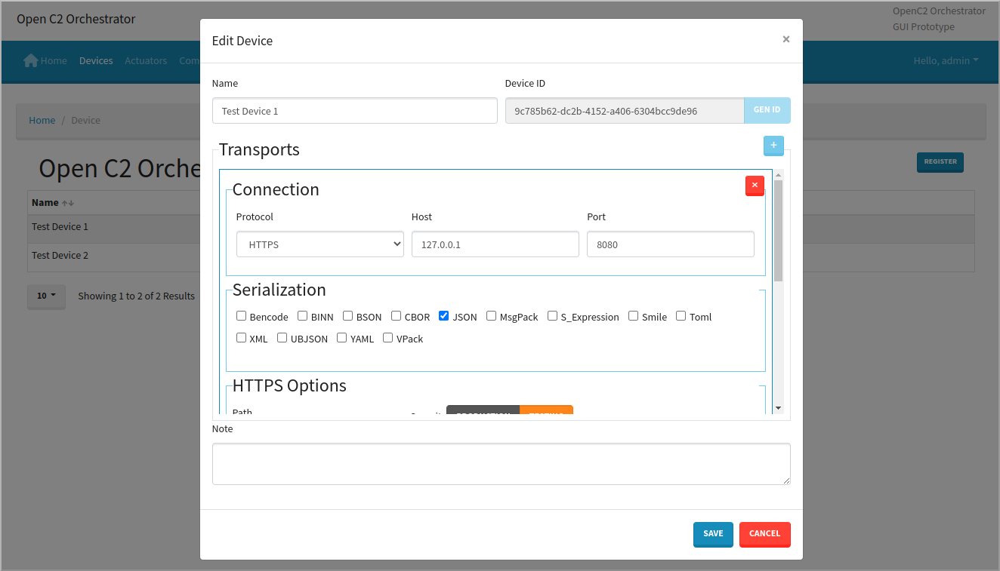

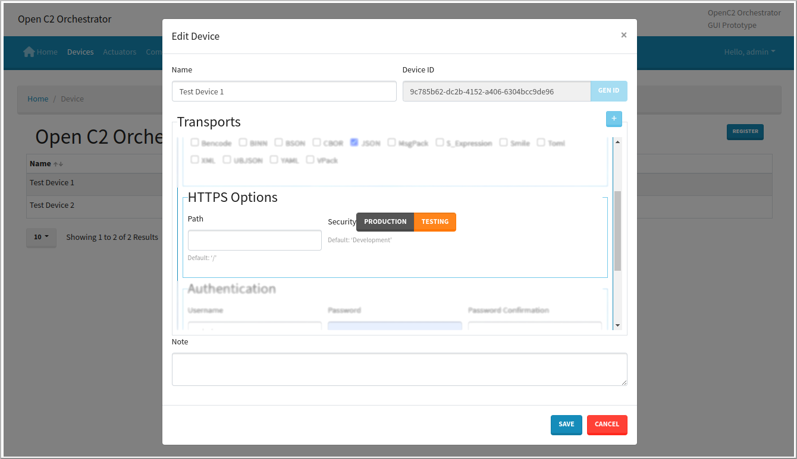

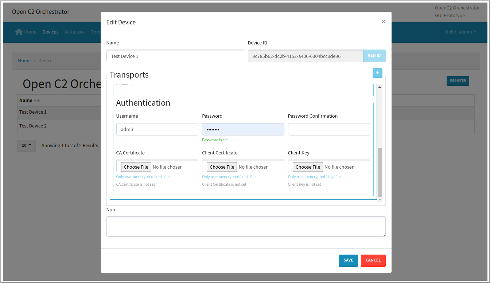

#### MQTT Registration Screen Shots

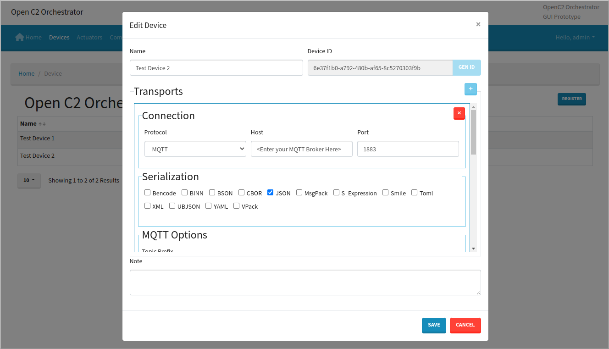

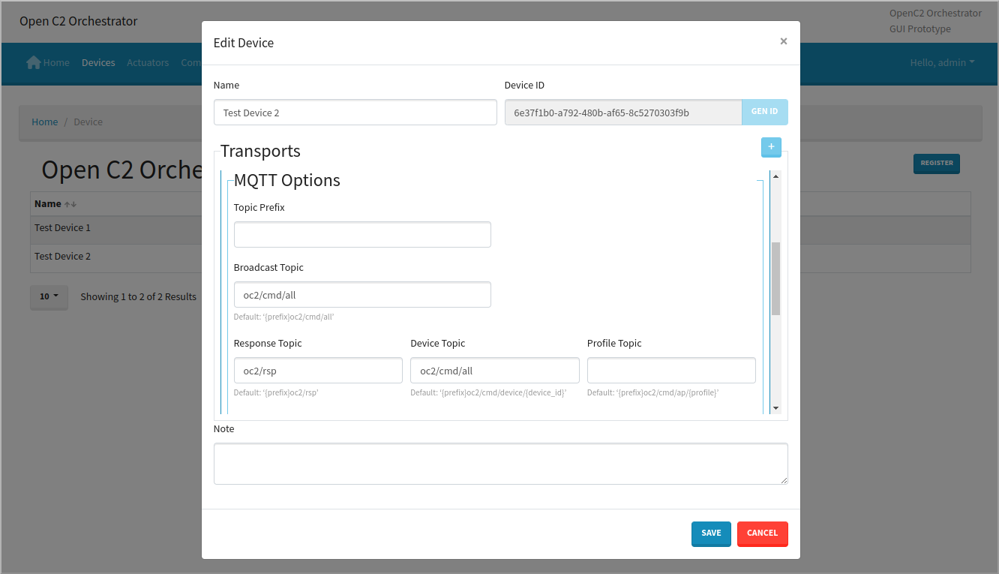

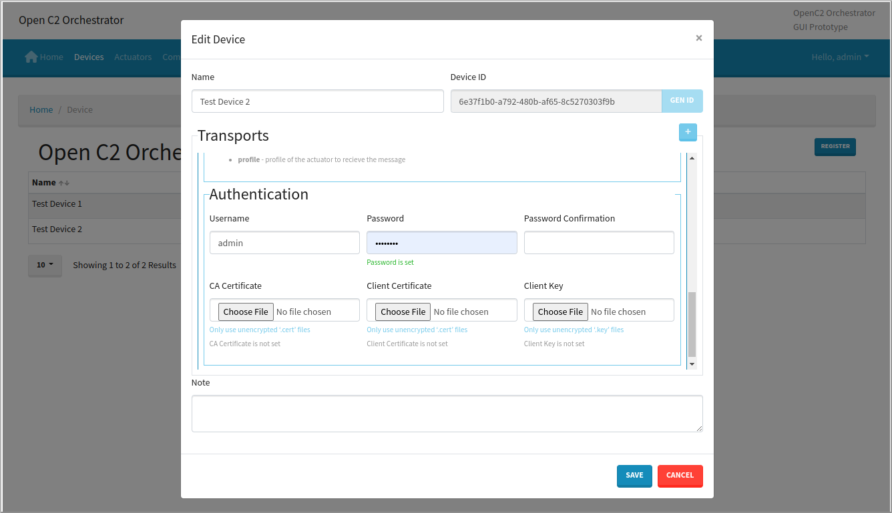

### Registering an Actuator with the OIF

The process for registering an actuator is similar to that
for a device. Every actuator is associated with a device, so
devices **must** be registered before their actuators. A
device can have multiple actuators; each actuator is
associated with a single device. 

The process for registering an actuator is:
1. Select `Actuators` from the Orchestrator menu; this
   brings up
  the list of registered actuators.
1. Click the `REGISTER` button at the right; this opens the
   dialog to register a new actuator.
1. Give the actuator a name (user's discretion).
1. Click the `GEN ID` button to generate an Actuator ID (Note: while
   the field permits user entry of an arbitrary ID, the
   Orchestrator expects a UUID value here).
1. Select the actuator's parent device from the menu of
   registered devices
1. Provide a JSON schema for the functions supported by the
   device. A schema can be pasted into the window, or the
   `Upload Schema` button at the bottom right opens a
   selection dialog to choose the appropriate schema file.
   1. Examples (Found under `/docs/schemas` in the openc2-oif-orchestrator repository)
      - [OpenC2 SLPF Schema](https://github.com/ScreamBun/openc2-oif-orchestrator/blob/master/docs/schemas/openc2_slpf-v1.0.1.json)
         - [About the Stateless Packet Filtering Actuator Profile and it's capabilities](https://docs.oasis-open.org/openc2/oc2slpf/v1.0/cs01/oc2slpf-v1.0-cs01.html) 
      - [OpenC2 Language Spec Schema](https://github.com/ScreamBun/openc2-oif-orchestrator/blob/master/docs/schemas/openc2_lang-v1.0.1.json)
         - Provided to allow the user to create their own Actuator Profile
   2. Experimental Examples - Coming Soon
      1. SBOM 
      2. OSQuery
      3. Endpoint Response
1. Click the `REGISTER` button at bottom right to complete
   the device registration.

The screenshots below show the registered actuators list and actuator
editing dialog:

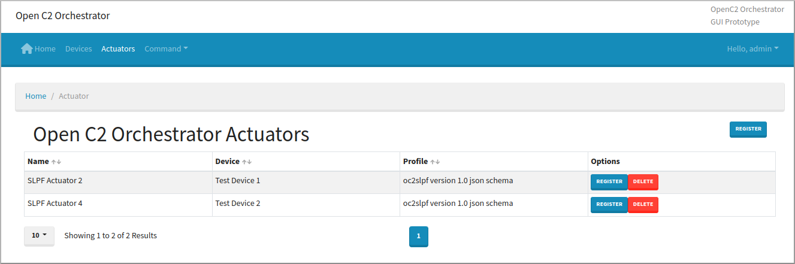

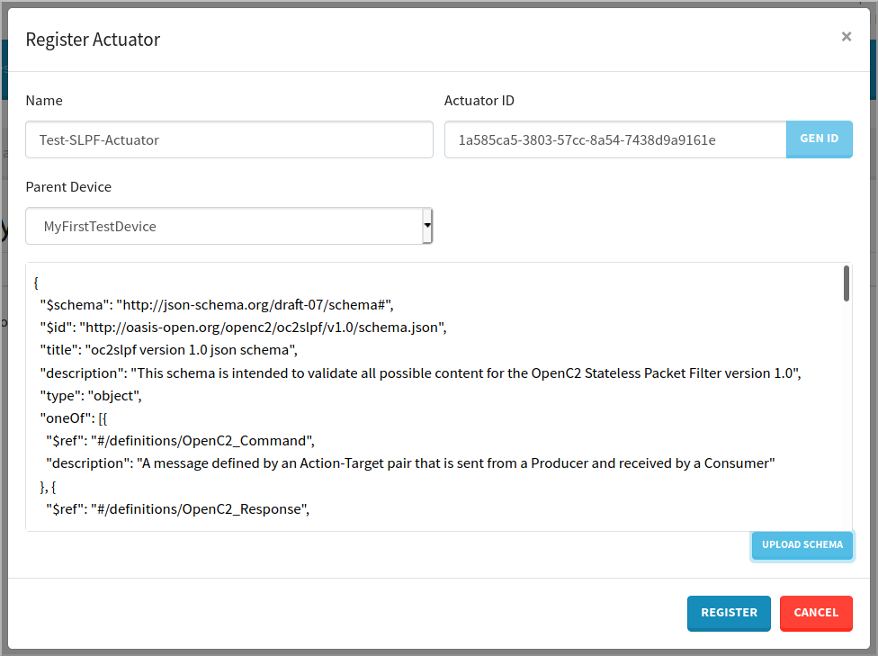

## 7) Generating Commands and Viewing Responses

Prerequisites for processing commands and responses:
- A device has been registered
- An actuator has been registered and associated with a
  device
- The OIF Orchestrator and Device are running, with a network
  connection between them 
  - Link to the OIF Device walk through coming soon 

The OIF Orchestrator has main menu functions to generate
commands (`Command Generator`), and to view the history of
commands and associated responses (`Commands`).

### Creating and Sending Commands

The steps to generate and send commands are as follows:

1. Select `Command Generator` from the main menu.

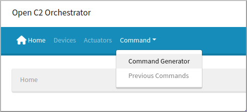

2. From the pull-down labeled `Schema`, select the schema for
  the desired actuator or actuator profile; the schema will
  be loaded in the pane below for reference.
3. Select the `Creator` tab on the right side, then click on
  `Message Type` and pick `OpenC2_Command`; a set of
  selection boxes will appear below, based on the selected
  schema. These boxes update dynamically when appropriate as
  the command is constructed.
4. Use the selection boxes to specify the desired command;
  for example:
   - action:  `query`
   - target:  `features`
   - feature:  `pairs`
5. Click the `Generate ID` button to assign a unique
  identifier to this command
6. Select the `Message` tab to see the message content and
  choose the Protocol and Serialization for sending this
  command.  Options will be limited to those supported by
  the device with which the actuator is associated.
7. Click the `Send` button to issue the command to the
  actuator.
8. A pop-up notification will appear reporting the command is
  sent, or any errors that occur.

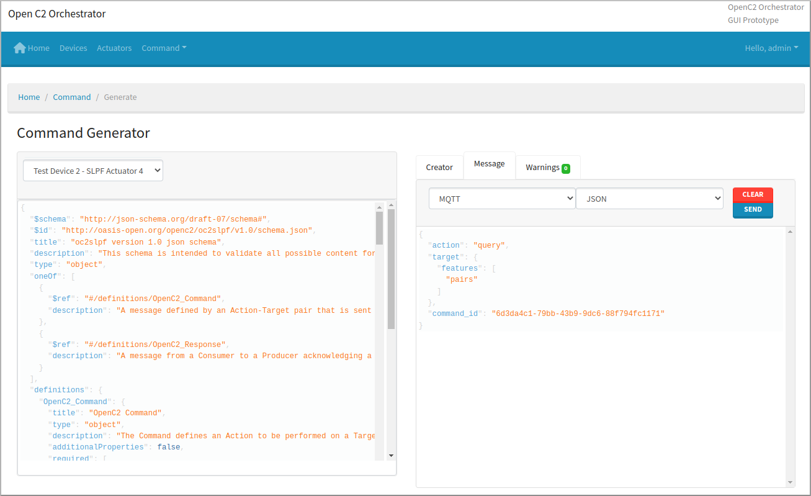

### Viewing Previous Commands / Response History

To view previous commands and their associated responses, select
`Previous Commands` from the main menu. A list will appear of all
commands that have been sent.

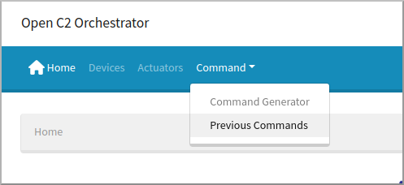

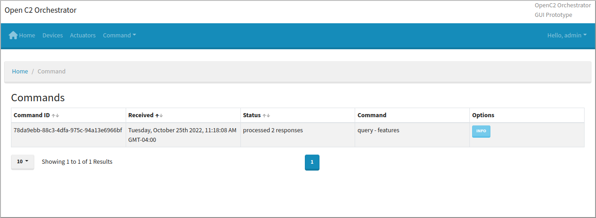

Click on the `Info` button for any command to see the
command / response history (the image below was edited to show
complete command and response together).

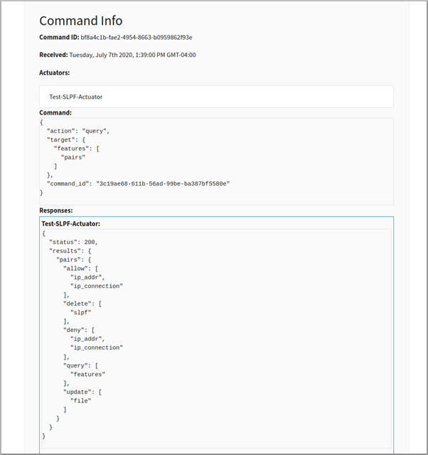

## (TBSL) Message Transfer via MQTT Publish / Subscribe

- If you are registering a new actuator for the first time
  while utilizing the MQTT transport you may need to update
  the `MQTT_TOPICS` environment variable. Read the MQTT
  Topics section [here](/orchestrator/transport/mqtt/ReadMe.md)

## Helpful Documentation

If needed, the ReadMe files for the OIF Orchestrator's components are linked here:
- Orchestrator
  - [GUI](../orchestrator/gui/ReadMe.md)
  - [Core](../orchestrator/producer-core/ReadMe.md) 
- Transports
  - [HTTPS](../orchestrator/transport/https/ReadMe.md)
  - [MQTT](../orchestrator/transport/mqtt/ReadMe.md)
- Logger
  - [GUI](../logger/gui/ReadMe.md)
  - [Server](../logger/server/ReadMe.md)

Tutorials are available for extending the OIF:
- Adding a [new serialization](./Serializations.md)
- Adding a [new transport protocol](./Transport.md)

[Top of Page](#openC2-integration-framework-(oif)-orchestrator-walk-through)